# CS 7641 Team 1 - Credit Card Fraud Detection
Joshua Hsu, Shaun Jacob, Andrew Novokshanov, Wanli Qian, Tongdi Zhou

# Introduction 

Every year the recorded number of fraudulent incidents increases worldwide. In 2020, the Federal Trade Commission reported nearly 2.2 million such cases in the United States alone [^fn1]. As technology continues to develop at blistering speeds, so do the ways that criminals steal information. As a result, the technology we use to deal with these problems must also evolve. The goal of our project is to distinguish incidents of fraudulent credit card use from those that are legitimate.

*Image courtesy of https://www.ftc.gov/reports/consumer-sentinel-network-data-book-2020*

# Problem Definition

By taking advantage of Machine Learning we can develop models to determine the legitimacy of a transaction. 

The primary premise of our project is to create Machine Learning models that can accurately predict whether a transaction is fraudulent or legitimate. In other words, when a new credit card transaction is attempted, we will be able to determine with a high degree of certainty whether the transaction should be labeled as fraudulent. 

We will be analyzing the problem at hand using supervised and unsupervised learning methods. Since both supervised and unsupervised methods can contribute to our problem analysis in unique ways, especially with respect to the high level of imbalance our dataset exhibits. 

Supervised learning models are commonly attributed to working well on classification problems. However, supervised learning requires labels, and we do not always have labels provided to us in a real-world scenario. In this circumstance, we have decided to also use unsupervised learning models. Unsupervised models do not require labels, and although unsupervised learning models are not commonly used for classification problems, they are useful for determining clustering, association, and performing dimensionality reduction. Unsupervised learning will help us determine what factors are relevant when analyzing the features of our data. 

Supervised learning models do have a limitation though – they are typically more susceptible to outliers and data imbalances, a prominent issue in our data. To alleviate the class imbalance, we propose to combine the under-sampling technique as well as the SMOTE algorithm to decrease the amount of data in the majority class (legitimate transactions) and increase the amount of data in the minority class (fraudulent transactions). 

Through a combination of these learning techniques, we hope to develop a holistic analysis of how various machine learning algorithms handle the classification of the legitimacy of credit card transactions.

For this midterm report, we have chosen to focus on unsupervised learning methods, specifically KMeans, GMM, and DBScan.

# Data Collection

Fortunately, the problem we are asking has been researched before and there are datasets available for us to use online. We ultimately decided to work with a dataset found on [Kaggle](https://www.kaggle.com/mlg-ulb/creditcardfraud), for the reasons that it was composed of real-life data samples and had 284,807 transactions listed. These transactions came from a period of two days by European card holders in September 2013. 

Although the data being grouped by a similar time range helps us analyze similar data, it also means that we have severely unbalanced data. Of the 284,807 transactions in the dataset, only 492 are fraud (0.173%). 

Moreover, due to the sensitive nature of using real life transaction data, much of the identifying data had to be anonymized. Most of the original features were not provided, and instead we were given thirty principal components obtained using PCA. We were also provided the original labels for the datasets to use for testing accuracy and for supervised learning.

# PCA Dataset Preprocessing and Visualization

Figure 1 shows the scatter plot of three PCA components with the highest variances. We can see the data set has a significant imbalance with the genuine class overwhelming the fraud class. We also notice a large overlap between the two classes of data, which brings challenges to the classification tasks.  

One way to combat class imbalance is under-sampling the majority class. We under-sample the genuine class by randomly retaining 10% of the genuine transactions. The resulting scatter plot is shown in Figure 2. A drawback of under-sampling is some information about the majority class may be lost. As a result, the under-sampling ratio cannot be too low. 

To further alleviate class imbalance, we use Synthetic Minority Over-sampling Technique (SMOTE) to increase the number of samples in the minority class. SMOTE synthesizes samples feature-by-feature: for each feature in an original sample, SMOTE finds its k-nearest neighbors in the feature space, chooses one neighbor at random, and picks a point at random along the line segment between the sample and its neighbor as the synthesized new sample. Figure 3 shows the result of SMOTE where we generate nine new samples from each original sample using its 10-nearest neighbors.  

Chawla, N. V., Bowyer, K. W., Hall, L. O., & Kegelmeyer, W. P. (2002). SMOTE: synthetic minority over-sampling technique. Journal of artificial intelligence research, 16, 321-357. 

Figure 4 shows the cumulative total variance of the PCA components for the original data and the data generated by SMOTE. As we can see, for both sets of data, the first 7 PCA components capture over 50% of the total variance, while the first 16 PCA components capture over 80% of the total variance. This information can guide the number of PCA components required for training classification models. We expect the first 16 PCA components to contribute the most to our models, while the rest of the PCA components may only bring negligible improvement.  

Figure 5 is the scatterplot matrix showing the relationship between the first 7 PCA components, where the red dots represent fraudulent transactions and the blue dots are genuine transactions.  We can see although no two features can perfectly separate the two classes, each combination of the features can separate some parts of the data, which will be exploited by our models to obtain better classification performance. We also observe that the boundaries between the two classes are highly nonlinear. As a result, we expect machine learning techniques that produce nonlinear decision boundaries will have better performance in classifying the two classes.  

# Unsupervised Learning Method

For our particular dataset, unsupervised learning becomes particularly useful. Because of confidentiality issues, the original data and labels are not provided. Our dataset only contains numerical input variables that are the result of a PCA transformation. Although we have simulated data, it is still inconvenient to integrate our models with real-world datasets because they are unlikely to be labeled. However, by applying clustering algorithm such as GMM(Gaussian Mixture Models) we could circumvent this problem. 

Prior work has shown that using GMM in conjunction with PCA is effective in reducing the complexity from high-dimensional data. Johannes Hertrich from TU Berlin proposed a Novel Gaussian Mixture Model with a PCA dimensionality reduction module in each component of the model [^fn2]. Additionally, Nada Alqahtani proposed a bivariate mixture model and showed that learning with a bivariate Gaussian mixture model is able to decrease the complexity brought by the high dimensionality of the input data[^fn3].

## K-Means

### Motivation

### Setup
The k-means algorithm is an unsupervised data clustering algorithm. It is initialized by randomly choosing k vectors as the mean vectors for the k clusters. Each data point then is assigned to the k clusters according to their Euclidean distance to the k mean vectors. After the assignment, the k mean vectors are updated using the average of the data points that were just assigned to each cluster. The process is iterated until the k mean vectors converge to a steady-state. Since the Euclidean distance is used to assign data points, the decision boundaries for the assignment are linear. As a result, we do not expect good clustering results for our data, since as previous visualization shows, the boundary between the fraud and non-fraud classes is highly nonlinear.  

## GMM

### Motivation
When exploring clustering with supervised learning methods, GMM is one of the first options chosen. Where K-Means suffers due to disregarding variance, GMM uses the covariance of a distribution to cluster data. Furthermore, GMM provides us with soft-classifications as opposed to K-Mean's hard classification. This means that should we choose so, we can analyze the likelihood of a given point belonging to a specific cluster.

### Setup
Since the data we were provided was already transformed via PCA, it allowed us to skip most of the pre-processing that would be associated with GMM I.e. PCA. 

We begin by shuffling the data to eliminate any pre-existing bias in the ordering of the data points and to try to ensure an even distribution of fraudulent transactions amidst our heavily imbalanced dataset for when we perform K-Fold validation. 

Once the data is shuffled, we need to separate the data from the labels and normalize the data in order to keep all values within a common scale that is maintained across features. After the labels are separated from the data, we use SciKit-Learn's MinMaxScalar to normalize our data between 0 and 1. 

Once our data is normalized, we can begin performing GMM. Starting with the first 2 PCA components, we run SciKit-Learn's GMM to create and label datapoints into two clusters. To limit overfitting on our data, given that we had so few fraudulent cases to train with, we use K-Fold validation with K = 5. After obtaining labels, we create a confusion matrix of our labels compared to the data's original labels. Using the confusion matrix, we calculate the recall and accuracy of the GMM algorithm with those PCA components. 

To examine the results that increasing features had on the results, we then perform the same operation with additional PCA components, adding a new component each run until all features are being used.

To gain a better understanding of the overall similarities between the ground truth and our predicted data, we calculate the Fowlkes Mallows score.

Finally, to determine how similar and distinct our two clusters of data are when incorporating all features, we calculate the Silhouette score for our newly labelled data. 

## DBSCAN

### Motivation
The objective we wanted to achieve with the use of DBSCAN and other unsupervised clustering methods was to see if there was a clear divide in the data in terms of whether a transaction was fraud or genuine. Additionally, with DBSCAN, we also hoped to figure out which features would help the most in terms of clustering and classification as well as finding out different methods to combat the imbalance within the dataset.

### Setup
One technique we use to deal with imbalance within the dataset is to undersample the genuine cases by a factor of 10. This still results in around 28,000 cases of genuine transactions and only 492 cases of fraud. Ideally, this undersampling does not affect the clustering in a significant manner, but due to the random sampling from the under-sampling step and the sensitivity of the DBSCAN algorithm to its parameters, there is sometimes a discrepancy in the clustering results. 

Another benefit of the under-sampling step for DBSCAN is that it cuts down computation time for the algorithm quite heavily since there are ~90% less datapoints which results in about 10x the computation speed. Due to the sensitivity of the DBSCAN algorithm to parameters, this is very important since tuning the parameters often takes 30+ trials to reach optimal parameters. 

Due to the way DBSCAN functions, often times there were a large number of clusters, for example in the 50s, which evidently does not represent the data very well. We made some important interpretations of the clustering by assuming that the first cluster (the 0 cluster) is comprised entirely of genuine transactions and that any point outside that first cluster is considered a fraudulent case. We interpret the clustering data as such because we expected most of the genuine transactions to be relatively similar to each other while the fraudulent cases would be comprised of more anomalous cases. For example, for real-life fraudulent transactions detection, often times the more anomalous and unique a transaction, the more likely it can be considered fraud.

# Potential Results and Discussion

## Unsupervised Methods

### K-Means

Figure 1 shows the result from k-means clustering on the original data with k set to 5. We use all 30 features for clustering, but we only plot the first three PCA components to visualize the result. Since the k-means algorithm only outputs two clusters with no labels, we need to manually assign labels to the clusters. Since this is a binary classification problem, there are two possible label assignments, and we choose that assignment that maximizes the sum of the precision rate and the recall rate. As we can see, most data points are clustered to the genuine class, resulting in only 3.6% of the fraud cases being correctly clustered. 

### GMM

For GMM we analyzed and looked at several statistics: the accuracy and recall of GMM while increasing the number of features, and the silhouette and Fowlkes Mallows scores of each number of features. 

Prior to discussing the trends we noticed, we will showcase an example of the data obtained. 

For the sake of space, we have chosen to include the confusion matrices for only the K-Folds when all features were included in GMM. Each of the confusion matrices below represents the results of a single fold performed on the same dataset with the same number of features.

In these confusion matrices, a label of '0' represents that a data point is legitimate, and '1' represents a data point is fraudulent.

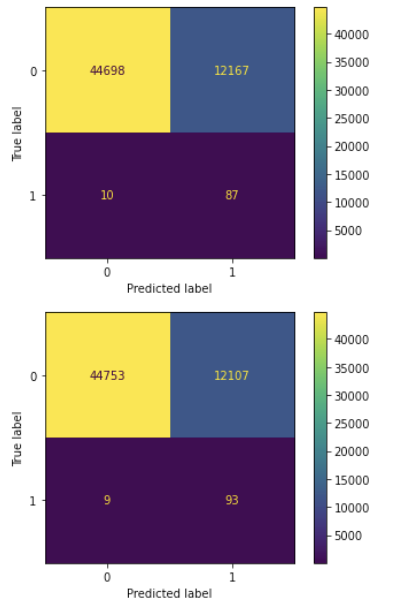
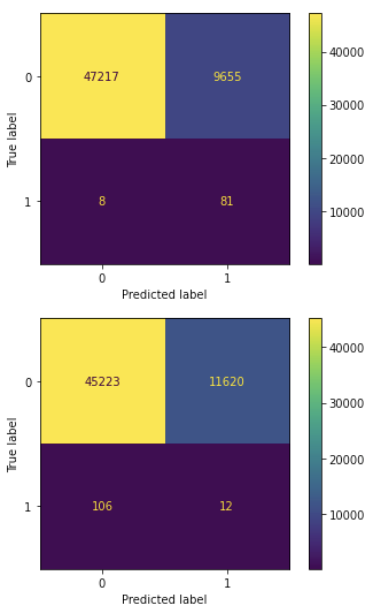
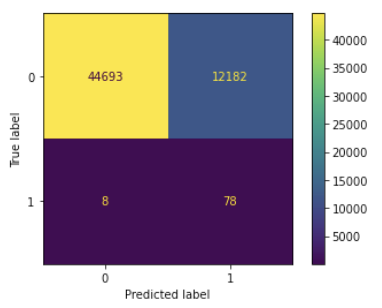

| # of Features     | Accuracy     | Recall       | Silhouette Score | Fowlkes Mallows Score |
|-------------------|--------------|--------------|------------------|-----------------------|
| First 2 Features  | 0.5454922101 | 0.2902969719 | 0.711251781      | 0.708816569           |
| First 3 Features  | 0.5430414297 | 0.4860989529 | 0.6898367591     | 0.7085121001          |
| First 4 Features  | 0.9082220618 | 0.6299913056 | 0.04769400875    | 0.91253134            |
| First 5 Features  | 0.8866390158 | 0.8147430894 | 0.05058364335    | 0.8934667314          |
| First 6 Features  | 0.8532374549 | 0.858076695  | 0.04419316824    | 0.8652723816          |
| First 7 Features  | 0.8296144333 | 0.8755722317 | 0.03910282344    | 0.8463533381          |
| First 8 Features  | 0.7519829256 | 0.8868225769 | 0.02903096514    | 0.7910113882          |
| First 9 Features  | 0.788526981  | 0.8958132884 | 0.03293773383    | 0.8156865426          |
| First 10 Features | 0.7764028377 | 0.8908290901 | 0.03733629964    | 0.8077359065          |
| First 11 Features | 0.7934390576 | 0.8920796907 | 0.03848657992    | 0.8191971082          |
| First 12 Features | 0.7920065066 | 0.9079713048 | 0.04224501212    | 0.8181669295          |
| First 13 Features | 0.7917537154 | 0.9070158292 | 0.04077599287    | 0.8179833715          |
| First 14 Features | 0.7866274395 | 0.9158068061 | 0.04060882066    | 0.8143375921          |
| First 15 Features | 0.7372185362 | 0.9255360675 | 0.05838087556    | 0.7817980117          |
| First 16 Features | 0.7442759626 | 0.9304549847 | 0.06414248894    | 0.7861453682          |
| First 17 Features | 0.7533979126 | 0.9299887626 | 0.06571932152    | 0.7919163783          |
| First 18 Features | 0.7653042344 | 0.9244928388 | 0.06890544838    | 0.7997048165          |
| First 19 Features | 0.779387444  | 0.9209241372 | 0.07360848102    | 0.8092733108          |
| First 20 Features | 0.7886147492 | 0.9064654924 | 0.07570879812    | 0.8157510162          |
| First 21 Features | 0.7989937374 | 0.9077426215 | 0.07655096005    | 0.8233548274          |
| First 22 Features | 0.7823859698 | 0.901716237  | 0.07218512419    | 0.8113584772          |
| First 23 Features | 0.7931652067 | 0.8948907401 | 0.07900520697    | 0.8189963437          |
| First 24 Features | 0.8248498546 | 0.8887499321 | 0.08158281379    | 0.8430537367          |
| First 25 Features | 0.79354441   | 0.8978958913 | 0.07802846789    | 0.8192683084          |
| First 26 Features | 0.8112405536 | 0.8967965011 | 0.07393604012    | 0.8327028871          |
| First 27 Features | 0.8298040528 | 0.8961269162 | 0.04824053294    | 0.8465011818          |
| First 28 Features | 0.8292422617 | 0.8928949577 | 0.04405685047    | 0.8460599351          |
| First 29 Features | 0.8259242247 | 0.890454028  | 0.04644154004    | 0.8434787284          |
| First 30 Features | 0.8165390099 | 0.8974196491 | 0.06855912929    | 0.8365486072          |

Overall, despite obtaining high recall when using many features GMM did not end up being very useful when trying to cluster datapoints. 

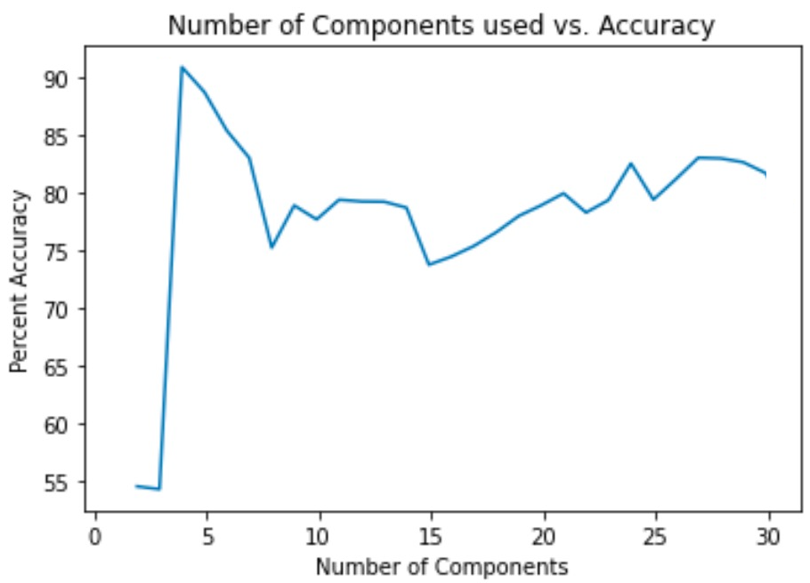
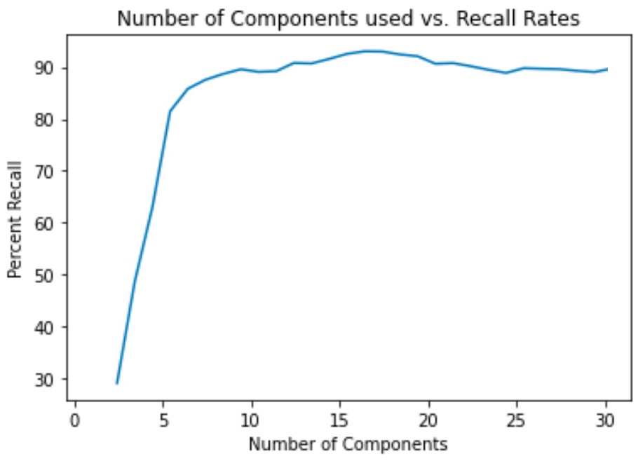

The increase in recall rate can be explained when we look at the accuracy rate and the visualizations taken of the results. Notably, accuracy is incredibly inconsistent. When we see high recall, it is usually because the algorithm had a cluster classify many transactions as fraud. While many fraudulent transactions do end up being marked as fraud, so do many more legitimate transactions as displayed in poor accuracy. Likewise, when accuracy is high but recall is either unchanged or even drops, it may be because GMM moves many more points into the legitimate than fraudulent cluster. So, even though fraudulent cases keep being labelled incorrectly, the accuracy obtained by labelling so many of the legitimate transactions correctly skews the accuracy.

Ultimately, this calls into question a fundamental flaw in GMM: we have little control over how the algorithm chooses to create clusters. Although we call clusters "fraudulent" and "legitimate", in reality these two clusters are just two groupings of points, and whether we call a cluster fraudulent or legitimate must be made based on our understanding of the input data. Although the GMM algorithm may end up clustering points based on features related to identifying if a transaction is legitimate or not, it is inconsistent.

We can see this by analyzing the visualizations of clusters for the first 2 K-Folds, specifically how different the clusters appear despite running for the same features and same dataset:

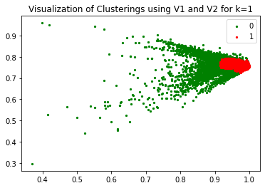
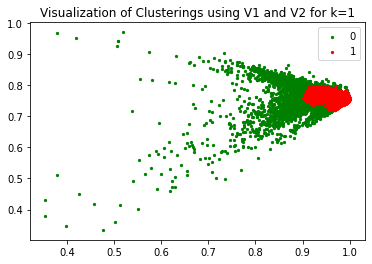

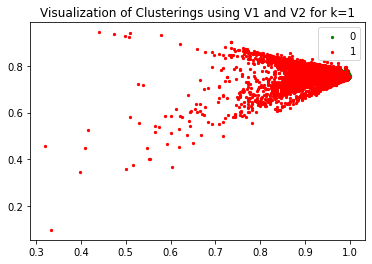

The most obvious discrepancy we see between some of the visualizations is that sometimes the majority of points are being labelled as 1, other times as 0. While we can infer from context that most points will be legitimate, and as a result the cluster with more data is legitimate, our data may not always allow for such inferences to be possible and furthermore we might not want to make such guesses.

Looking at actual distribution of each cluster, we also see that there are some pretty clear differences. In cases where many points are being clustered as fraudulent (smaller cluster), we find recall going up at the cost of accuracy, and the opposite where we have few data points in the fraudulent cluster.

By looking at the silhouette scores and Fowlkes Mallows scores for the clusters, showcasing how different and similar the clusters are to one another, we get further validation that GMM has not done well in splitting up our clusters in clear, distinguishable groupings. We consistently see that the silhouette score remains near 0, indicating that the two clusters are not very different from one another.

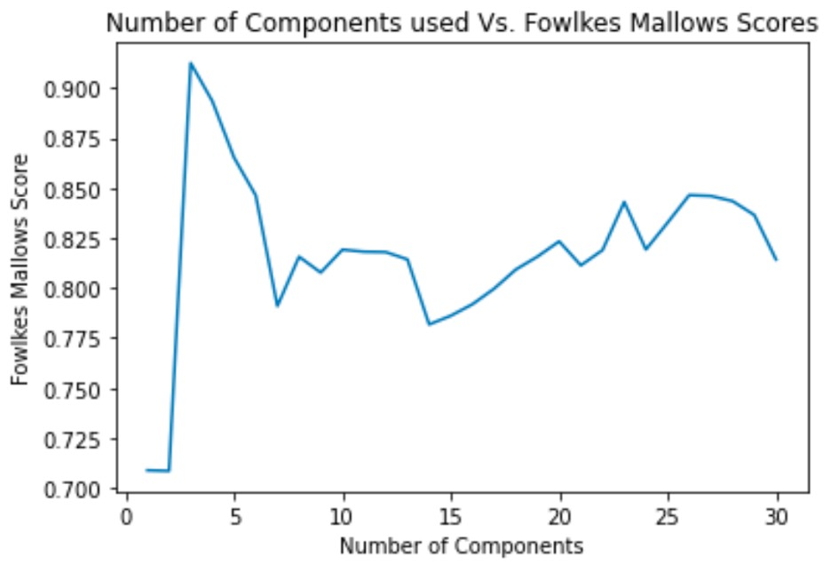

Finally, we look at the Fowlkes Mallows score we can look at how closely our predictions matched the ground truth. This score consistently stayed at approximately 0.8, matching what we would expect. While we tended to have most of the legitimate datapoints labelled correctly, fraudulent datapoints were labelled correctly slightly better than via guessing. Averaging these two percents, we get around 80% i.e. Fowlkes Mallows score of 0.8 .

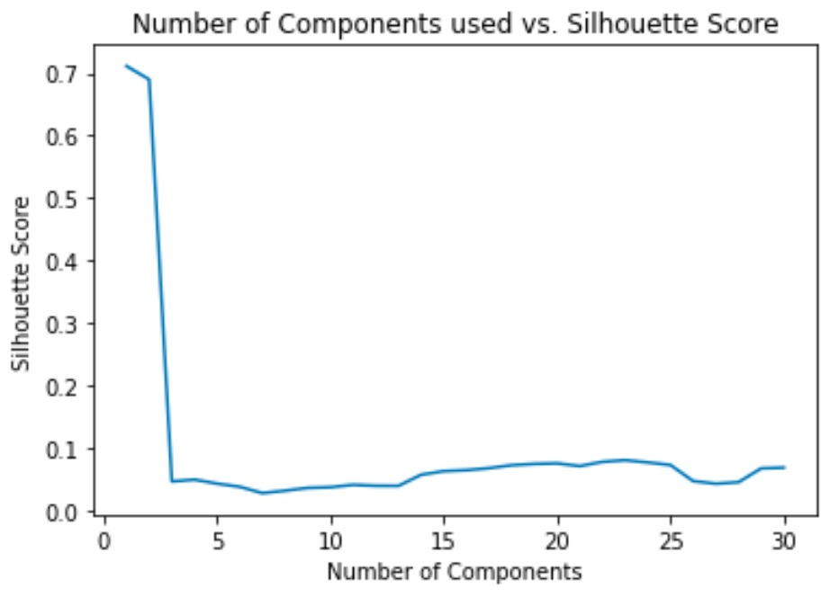

### DBSCAN

The following is the confusion matrix for the data after running DBSCAN for all 28 PCA components. The results are normalized based on the ground truth labels so the numbers can be interpreted as percentages. The “0” label represents genuine transactions, while the “1” label represents fraudulent transactions. With DBSCAN, we are able to achieve a fraud detection rate of around 81%, which represents the percentage of fraudulent cases that are correctly clustered. On the other hand, we achieved a genuine transaction detection rate of over 99% which represents the percentage of genuine transactions clustered correctly with the genuine cluster. Overall, these results are better than expected, since we anticipated that the high-dimensionality property of the data would cause issues with the DBSCAN clustering because of the relative simplicity of the algorithm, but ultimately out of the three unsupervised methods we explored, DBSCAN was the best overall in clustering the data.

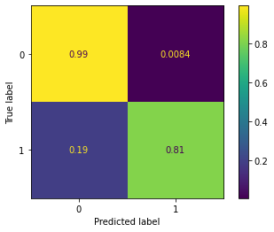

Here is the 3-D plot of the dataset utilizing the first 3 PCA components. The red x’s signify a misclassification while the green x’s signify correct classifications for both genuine and fraud cases. From this plot, we see that the misclassifications are spread evenly throughout the dataset which may point to a complexity in the dataset that DBSCAN may not have picked up on. 

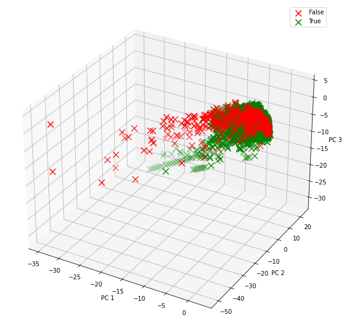

Our expectations for DBSCAN were not very high when we first experimented with it due to the high-dimensionality of the data, but we also expected DBSCAN to perform better than K-Means due to the ability for DBSCAN to not rely on linear decision boundaries, which we found to be a huge issue for K-Means clustering. While DBSCAN did not perform quite as well as GMM in terms of recall for the fraudulent transactions, it was more proficient at properly clustering the genuine transactions with a precision of over 99%. Overall, DBSCAN proved to be serviceable to clustering the dataset, and serves as an important stepping stone to more robust and accurate supervised classifications that we will explore next. 

## Conclusion

Overall, the results we obtained using unsupervised learning were not incredible, but were also not unexpected.

Due to the high variance in our data and their features, KMeans, which is better at clustering where there exists linear boundaries between clusters, displayed very poor results overall.

With GMM, despite some initially positive results, ultimately did not end up being a consistent model for creating clusters of legitimate and fraudulent data. Where we saw high recall oftentimes came with the sacrifice of accuracy, and vice versa. On average, our model's success with accuracy can be described as rarely better than classifying data via a coin flip.

Overall, we ended up having the best success with DBScan. Although recall was not incredible, DBScan was consistent in classifying legitimate transactions correctly. 

# Supervised Learning Method

Although for this midterm report we focused on developing our unsupervised learning models and analyzing the results from them, we are currently working on the supervised learning models and will include their details in the final report.

For supervised learning we will be training a Neural Network to classify the data points as fraudulent or not fraudulent. Neural Networks work best when we have large amounts of data, often outperforming traditional machine learning algorithms [^fn4]. Since we can use the simulator to generate as much data as we want, using a Neural Network will give us more accurate results. A factor that comes into play in the success of our algorithm is domain knowledge, which in traditional machine learning algorithms is used to identify features in order to reduce the complexity of the raw data and make patterns clearer to the algorithm. Another advantage of Neural Networks is that they also work well when there is a general lack of domain knowledge. This is because they learn the high-level features of the dataset in an incremental fashion [^fn4]. Due to that, we don’t have to worry about feature engineering or domain knowledge.

## Sources:

[^fn1]: Federal Trade Commission. (2021, February). Consumer Sentinel Network Data book 2020. Consumer Sentinel Network. Retrieved October 2, 2021, from https://www.ftc.gov/system/files/documents/reports/consumer-sentinel-network-data-book-2020/csn_annual_data_book_2020.pdf. 

[^fn2]: Hertrich, J., Nguyen, D., Aujol, J., Bernard, D., Berthoumieu, Y., Saadaldin, A., & Steidl, G. (2021). PCA reduced Gaussian mixture models with applications in superresolution. Inverse Problems & Imaging, 0(0), 0. doi:10.3934/ipi.2021053 

[^fn3]: Alqahtani, N. A., & Kalantan, Z. I. (2020). Gaussian Mixture Models Based on Principal Components and Applications. Mathematical Problems in Engineering, 2020, 1-13. doi:10.1155/2020/1202307

[^fn4]: Mahapatra, S. (2019, January 22). Why deep learning over traditional machine learning? Medium. Retrieved October 1, 2021, from https://towardsdatascience.com/why-deep-learning-is-needed-over-traditional-machine-learning-1b6a99177063. 

