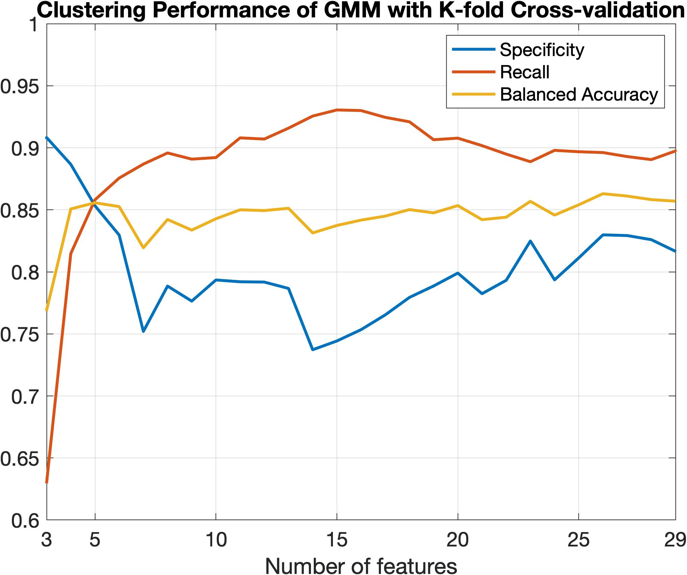
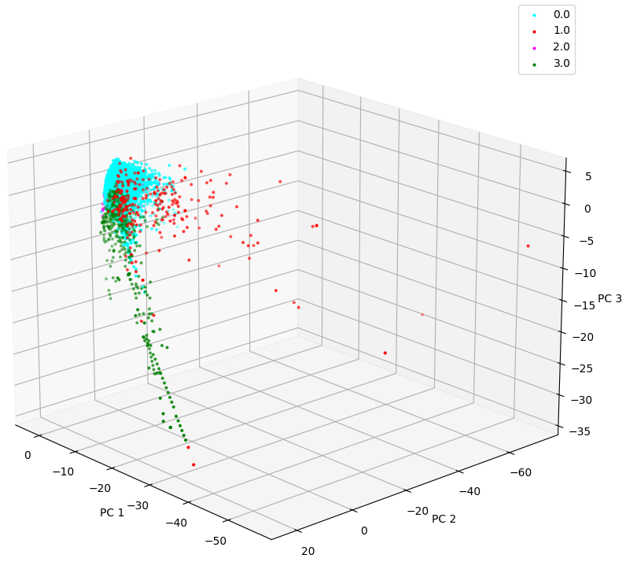

# CS 7641 Team 1 - Credit Card Fraud Detection
Joshua Hsu, Shaun Jacob, Andrew Novokshanov, Wanli Qian, Tongdi Zhou

# 1 Introduction 

Every year the recorded number of fraudulent incidents increases worldwide. In 2020, the Federal Trade Commission reported nearly 2.2 million such cases in the United States alone [^fn1]. As technology continues to develop at blistering speeds, so do the ways that criminals steal information. As a result, the technology we use to deal with these problems must also evolve. The goal of our project is to distinguish incidents of fraudulent credit card use from those that are legitimate.

*Image courtesy of https://www.ftc.gov/reports/consumer-sentinel-network-data-book-2020*

# 2 Problem Definition

By taking advantage of Machine Learning we can develop models to determine the legitimacy of a transaction. 

The primary premise of our project is to create Machine Learning models that can accurately predict whether a transaction is fraudulent or legitimate. In other words, when a new credit card transaction is attempted, we will be able to determine with a high degree of certainty whether the transaction should be labeled as fraudulent. 

We will be analyzing the problem at hand using supervised and unsupervised learning methods. Both supervised and unsupervised methods can contribute to our problem analysis in unique ways, especially with respect to the high level of imbalance our dataset exhibits. 

Supervised learning models are commonly attributed to working well on classification problems. However, supervised learning requires labels, and we do not always have labels provided to us in a real-world scenario. In this circumstance, we have decided to also use unsupervised learning models. Unsupervised models do not require labels, and although unsupervised learning models are not commonly used for classification problems, they are useful for determining clustering, association, and performing dimensionality reduction. Unsupervised learning will help us determine what factors are relevant when analyzing the features of our data. 

Supervised learning models do have a limitation though – they are typically more susceptible to outliers and data imbalances, a prominent issue in our data. To alleviate the class imbalance, we propose to combine the under-sampling technique as well as the SMOTE algorithm to decrease the amount of data in the majority class (legitimate transactions) and increase the amount of data in the minority class (fraudulent transactions). 

Through a combination of these learning techniques, we hope to develop a holistic analysis of how various machine learning algorithms handle the classification of the legitimacy of credit card transactions.

For this midterm report, we have chosen to focus on unsupervised learning methods, specifically K-Means, Gaussian Mixture Model (GMM), and Density-Based Spatial Clustering of Applications with Noise (DBSCAN).

# 3 Data Collection

Fortunately, the problem we are exploring has been researched before and there are datasets available for us to use online. We ultimately decided to work with a dataset found on [Kaggle](https://www.kaggle.com/mlg-ulb/creditcardfraud), since it is composed of real-life data samples and has 284,807 transactions listed. These transactions came from a period of two days by European card holders in September 2013. 

Although the data being grouped by a similar time range helps us analyze similar data, it also means that we have severely unbalanced data. Of the 284,807 transactions in the dataset, only 492 are fraud (0.173%). 

Moreover, due to the sensitive nature of using real life transaction data, much of the identifying data had to be anonymized. Most of the original features were not provided, and instead we were given 28 principal components obtained using PCA, the Transaction Time, the Amount. We were also provided the original ground truth labels for the dataset to use for evaluating the model and for supervised learning.

# 4 Data Visualization and Preprocessing

An important step in machine learning is data visualization, which provides us with an accessible way to better understand the characteristics, trends, and patterns of the dataset. In this section, we will visualize our data, both before and after preprocessing. The figure below shows the scatter plot of the three PCA components with the highest variances. We can see the dataset has a significant imbalance with the genuine class overwhelming the fraud class. We also notice a large overlap between the two classes of data, which brings challenges to the classification tasks. 

One way to combat class imbalance is undersampling the majority class. We under-sample the genuine class by randomly retaining 10% of the genuine transactions. The resulting scatter plot is shown in the figure below. A drawback of under-sampling is some information about the majority class may be lost. As a result, the under-sampling ratio cannot be too low. 

To further alleviate class imbalance, we use Synthetic Minority Over-sampling Technique (SMOTE) to increase the number of samples in the minority class [^fn5]. SMOTE synthesizes samples feature-by-feature: for each feature in an original sample, SMOTE finds its k-nearest neighbors in the feature space, chooses one neighbor at random, and picks a point at random along the line segment between the sample and its neighbor as the synthesized new sample. The figure below shows the result of SMOTE where we generate nine new samples from each original sample using its 10-nearest neighbors. After using both the undersampling and the SMOTE, the ratio between the legitimate class and the fraud class decreases from 579:1 to 5.79:1. We will mainly use these two class rebalancing techniques for supervised learning methods since they are more suspectable to an imbalanced dataset.

The figure below shows the cumulative total variance of the PCA components for the original data and the data generated by SMOTE. As we can see, for both sets of data, the first 7 PCA components capture over 50% of the total variance, while the first 16 PCA components capture over 80% of the total variance. This information can guide the number of PCA components required for training classification models. We expect the first 16 PCA components to contribute the most to our models and the rest of the PCA components may only bring negligible improvement. 

The next figure illustrates the scatterplot matrix showing the relationship between the first 7 PCA components, where the red dots represent fraudulent transactions and the blue dots are genuine transactions.  We can see that although no two features can perfectly separate the two classes, each combination of the features can separate some parts of the data, which will be exploited by our models to obtain better classification performance. We also observe that the boundaries between the two classes are highly nonlinear. As a result, we expect machine learning techniques that produce nonlinear decision boundaries to have better performance in classifying the two classes.  

# 5 Unsupervised Learning Methods

For our particular dataset, unsupervised learning becomes particularly useful. Because of confidentiality issues, most of the original features are not provided. Our dataset only contains the outputs of a PCA transformation. We experimented with various unsupervised learning methods, including probabilistic clustering algorithms such as GMM and deterministic clustering algorithms like K-Means and DBSCAN. By comparing these three methods, we will try to look at which method yields better clustering performance for our dataset. Since we are using clustering algorithms, we chose to omit the Time feature from our dataset due to the fact that we are treating each data point as a discrete transaction. Therefore, time would not play a significant role in differentiating the 2 classes.

## 5.1 K-Means

### Motivation

We start with the K-Means algorithm since it is one of the easiest clustering algorithms to implement. Although the problem is NP-hard, efficient heuristic algorithms converge quickly to a solution that is good enough for most applications.

### Setup
The K-Means algorithm is initialized by randomly choosing k vectors as the mean vectors for the k clusters. Each data point is then assigned to the k clusters according to their Euclidean distance to the k mean vectors. After the assignment, the k mean vectors are updated using the average of the data points that were assigned to each cluster. The process is iterated until the k mean vectors converge to a steady-state. Since the Euclidean distance is used to assign data points, the decision boundaries for the assignment are linear. As a result, we do not expect good clustering results for our data, since as previous visualizations show, the boundary between the fraud and non-fraud classes is highly nonlinear. For our dataset, we evaluate the clustering performance of the k-means algorithm using all the features available with k = 2.

## 5.2 GMM

### Motivation
When exploring clustering with unsupervised learning methods, GMM is one of the first options chosen. While K-Means suffers due to disregarding variance, GMM uses the covariance of a distribution to cluster data. Furthermore, GMM provides us with soft-clusterings as opposed to K-Means's hard clusterings. This means that should we choose so, we can analyze the likelihood of a given point belonging to a specific cluster.

### Setup
Since the data we were provided was already transformed via PCA, it allows us to skip most of the pre-processing that would be associated with GMM (PCA).

We begin by removing the labels from our dataset and shuffling the data to eliminate any pre-existing bias in the ordering of the data points and to try to ensure an even distribution of fraudulent transactions.

Starting with the first 3 features, we run SciKit-Learn's GMM to group datapoints into two clusters. After obtaining predictions, we create a confusion matrix of our predictions compared to the data's original labels. Using the confusion matrix, we calculate the recall and precision of the GMM algorithm.

To examine the impact that increasing features had on the results, we then perform the same operation with additional features, adding a new feature each iteration until all features are used.

To gain a better understanding of the overall similarities between the ground truth and our predicted data, we calculate the Fowlkes-Mallows score, which is the Geometric Mean of the Precision and Recall of our model. We also use the F Score, which measures the Harmonic Mean of the Precision and Recall of our model.

Finally, to determine how similar and distinct our two clusters are, we calculate the Silhouette score for our newly labelled data.

To better evaluate our model performance and possibly detect overfitting, we also repeat the above process using a K-Fold validation with K = 5. We will then average the Precision, Recall, and F Scores across all folds. 

## 5.3 DBSCAN

### Motivation
The next clustering algorithm we want to examine is DBSCAN due to its relative simplicity compared to GMM and for its ability to handle outliers well. The objective we want to achieve with the use of DBSCAN is to see if there is a clear divide in the data in terms of whether a transaction is fraud or genuine. Additionally, with DBSCAN, we also hope to figure out which features will help the most in terms of clustering.

### Setup
One technique we use to deal with imbalance within the dataset is to undersample the genuine cases by a factor of 10. This still results in around 28,000 cases of genuine transactions and only 492 cases of fraud. Undersampling does not affect the clustering in a significant manner, but due to the random sampling from the under-sampling step and the sensitivity of the DBSCAN algorithm to its parameters, there is sometimes a small discrepancy in the clustering results.

Another benefit of the under-sampling step for DBSCAN is that it cuts down computation time for the algorithm quite heavily since there are ~90% less datapoints which results in about 10x the computation speed. Due to the sensitivity of the DBSCAN algorithm to parameters, this is very important since tuning the parameters often takes 30+ trials to reach optimal parameters. 

Due to the way DBSCAN functions, often times there were a large number of clusters, for example in the 50s, which evidently does not represent the data very well. We made some important interpretations of the clustering by assuming that the first cluster (the 0 cluster) is comprised entirely of legitimate transactions and that any point outside that first cluster is considered a fraudulent case. We interpret the clustering data as such because we expect most of the legitimate transactions to be relatively similar to each other while the fraudulent cases would be comprised of more anomalous cases. For example, for real-life fraudulent transaction detection, often times the more anomalous and unique a transaction, the more likely it can be considered fraud.

# 6 Supervised Learning Method

Although for this midterm report we focused on developing our unsupervised learning models and analyzing the results from them, we are currently working on the supervised learning models and will include their details in the final report.

For supervised learning we will be training a Neural Network to classify the data points as fraudulent or not fraudulent. Neural Networks work best when we have large amounts of data, often outperforming traditional machine learning algorithms [^fn4]. Since we can use the simulator to generate as much data as we want, using a Neural Network will give us more accurate results. A factor that comes into play in the success of our algorithm is domain knowledge, which in traditional machine learning algorithms is used to identify features in order to reduce the complexity of the raw data and make patterns clearer to the algorithm. Another advantage of Neural Networks is that they also work well when there is a general lack of domain knowledge. This is because they learn the high-level features of the dataset in an incremental fashion [^fn4]. Due to that, we don’t have to worry about feature engineering or domain knowledge.

# 7 Results and Discussion

## 7.1 Unsupervised Methods

### 7.1.1 K-Means

The figure above shows the result from k-means clustering on the original data with k set to 2. We use all the features for clustering, but we only plot the first three PCA components to visualize the result. Since the k-means algorithm only outputs two clusters with no labels, we need to manually assign labels to the clusters. Since this is a binary classification problem, there are two possible label assignments, and we choose the assignment that maximizes the sum of the precision rate and the recall rate. As we can see, most data points are clustered to the genuine class, resulting in only 3.6% of the fraud cases being correctly clustered. 

### 7.1.2 GMM

<!-- Non K-Fold Section -->

We started with the more naive approach, where we fitted our GMM to the entire dataset and compared our predictions to the ground truths. For GMM we analyzed and looked at several statistics: the precision, recall, and F scores of GMM while increasing the number of features. Overall, we were able to obtain high recall, precision, and F scores, indicating that GMM ended up being useful when trying to cluster datapoints.

As we increased the number of features, the F Score gradually increased as well, indicating better performance as we added more features.

We noticed that precision steadily decreased until the 20th feature and sharply rose at the 21st feature. PCA outputs the principal components ordered by their variance. This doesn't necessarily imply that that the first few principal components are the most influential features in differentiating the two clusters. We can use the 21st feature as an example. Due to the natural ordering of the PCA components, the 21st feature has a smaller variance than the first few PCA components. Despite this, we experienced a sharp increase in precision and F Score, indicating that this particular feature had a significant contribution to the model's ability to classify transactions.

By looking at the silhouette scores and Fowlkes Mallows scores for the clusters, showcasing how different and similar the clusters are to one another respectively, we can further evaluate the cluster assignments of GMM. We consistently see that the silhouette score remains near 0, indicating that the two clusters are not very different from one another and that most of the points lie very close to the decision boundary between the 2 clusters. This matches our distribution shown in the preprocessing and visualization section.

Looking at the Fowlkes Mallows score, we can evaluate how closely our predictions matched the ground truth. This score consistently stayed at approximately 0.8, matching what we would expect. Fowlkes Mallows can be used to evaluate the similarity between our true clusters (the labels in our dataset) and the clusters generated by our model's assignment. Since our model's clusterings closely matched the distribution of our dataset and the boundaries between the fradulent and legitimate transactions are not very distinct, we obtain a high Fowlkes Mallows score and a low Silhouette score.

<!-- K Fold Section -->

In an effort to minimize the impact of having such an unbalanced dataset we also used K-Fold cross-validation. The intent of this was to evaluate the performance of GMM given different proportions of fraudulent and legitimate transactions and possibly detect overfitting. The metrics have a higher degree of fluctuation comared to when we did not use K-Fold cross-validation. However, there was only a slight decrease in the overall performance of the model.

We can see why the overall accuracy and recall do not differ much from when we do not use K-Fold validation by looking at the following Confusion Matrices. These matrices represent two of the five folds obtained when running GMM on all features.

In these confusion matrices, a label of '0' represents that a data point is legitimate, and '1' represents a data point is fraudulent.

While four of the folds had results similar to the left matrix, with high recall and high accuracy, there was nearly always a case on the right with low recall and low accuracy. We suspect this is because with five folds, we are spreading the fraudulent testing data too thin, and ultimately end up having a fold where there is poor training data and by extension poor results in testing. When these inaccurate results occur, they drag down the average precision and accuracy.

We can see this by looking at visualizations obtained during two different runs of GMM when looking at the first two features.

The most obvious discrepancy we see between some of the visualizations is that sometimes the majority of points are being labelled as 1, and other times as 0. While we can infer from context that most points will be legitimate, and as a result the cluster with more data is legitimate, our data may not always allow for such inferences to be possible and furthermore we might not want to make such guesses.

Looking at actual distribution of each cluster, we also see that there are some pretty clear differences. In cases where many points are being clustered as fraudulent (smaller cluster), we find recall going up at the cost of accuracy, and the opposite where we have few data points in the fraudulent cluster.

### 7.1.3 DBSCAN

We ended up tuning the epsilon and minimum points per cluster for DBSCAN in order to maximize the F score. We found that setting the minimum points per cluster to two caused the best results. To tune the epsilon, we set it to an arbitrarily low value and kept increasing it as the F score increased along with epsilon, until the results "flipped", which was when the true positive rate plummeted to below 50%. 

The following is the confusion matrix for the data after running DBSCAN for all 28 PCA components. The results are normalized in the second figure shown which is based on the ground truth labels so the numbers can be interpreted as percentages. The “0” label represents legitimate transactions, while the “1” label represents fraudulent transactions. With DBSCAN, we are able to achieve a fraud detection rate of around 81%, which represents the percentage of fraudulent cases that are correctly clustered. On the other hand, we achieved a genuine transaction detection rate of over 99% which represents the percentage of legitimate transactions clustered correctly. 

These results are better than expected, since we anticipated that the high-dimensionality of the data would cause issues with the DBSCAN clustering because of the relative simplicity of the algorithm.

Here is the 3-D plot of the clustering of the dataset with DBSCAN which only shows the first 3 PCA components from different perspectives. The different colors correspond to cases of true positives, true negatives, false positives, and false negatives. The true negatives are classified with the color cyan (0), the false positives are the color red (1), the false negatives are the color magenta(2), and the true positives are the color green (3). To reiterate, the positive case, or the "1" case, represents the fraudulent case, while the negative case, or the "0" case, represents the legitimate cases. 

From this plot, we can see that there is a general trend of fraudulent transactions of going in the negative PC1, positive PC2, and negative PC3 direction. Meanwhile, the large bulk of legitimate transactions seem to occur near a zero value for all three principle components. Another observation from the 3-D plot is that nearly all of the false positives trend towards the negative direction in all 3 principle components shown. This shows one of the limitations to our approach to DBSCAN as it failed to identify these trends in the dataset that are easily identified in this plot. 

Our expectations for DBSCAN were not very high when we first experimented with it due to the high-dimensionality of the data, but we also expected DBSCAN to perform better than K-Means due to the ability for DBSCAN to not rely on linear decision boundaries, which we found to be a huge issue for K-Means clustering. While DBSCAN did not perform quite as well as GMM, it was more proficient at properly clustering the genuine transactions with a precision of over 99%. Overall, DBSCAN proved to be serviceable to clustering the dataset, and serves as an important stepping stone to more robust and accurate supervised classifications that we will explore next. 

# 7 Conclusion

Due to the high variance in our data and their features, KMeans, which is better at clustering where there exists linear boundaries between clusters, displayed very poor results overall.

Although recall was not incredible, DBScan was consistent in classifying legitimate transactions correctly. 

Overall, we ended up having the best success with GMM since it ended up performing the best in classifying transactions as legitimate or fraudulent. 

## Appendix:

GMM data when cross validation done using K-Folds

| # of Features     | Accuracy     | Recall       | Silhouette Score | Fowlkes Mallows Score |
|-------------------|--------------|--------------|------------------|-----------------------|
| First 2 Features  | 0.5454922101 | 0.2902969719 | 0.711251781      | 0.708816569           |
| First 3 Features  | 0.5430414297 | 0.4860989529 | 0.6898367591     | 0.7085121001          |
| First 4 Features  | 0.9082220618 | 0.6299913056 | 0.04769400875    | 0.91253134            |
| First 5 Features  | 0.8866390158 | 0.8147430894 | 0.05058364335    | 0.8934667314          |
| First 6 Features  | 0.8532374549 | 0.858076695  | 0.04419316824    | 0.8652723816          |
| First 7 Features  | 0.8296144333 | 0.8755722317 | 0.03910282344    | 0.8463533381          |
| First 8 Features  | 0.7519829256 | 0.8868225769 | 0.02903096514    | 0.7910113882          |
| First 9 Features  | 0.788526981  | 0.8958132884 | 0.03293773383    | 0.8156865426          |
| First 10 Features | 0.7764028377 | 0.8908290901 | 0.03733629964    | 0.8077359065          |
| First 11 Features | 0.7934390576 | 0.8920796907 | 0.03848657992    | 0.8191971082          |
| First 12 Features | 0.7920065066 | 0.9079713048 | 0.04224501212    | 0.8181669295          |
| First 13 Features | 0.7917537154 | 0.9070158292 | 0.04077599287    | 0.8179833715          |
| First 14 Features | 0.7866274395 | 0.9158068061 | 0.04060882066    | 0.8143375921          |
| First 15 Features | 0.7372185362 | 0.9255360675 | 0.05838087556    | 0.7817980117          |
| First 16 Features | 0.7442759626 | 0.9304549847 | 0.06414248894    | 0.7861453682          |
| First 17 Features | 0.7533979126 | 0.9299887626 | 0.06571932152    | 0.7919163783          |
| First 18 Features | 0.7653042344 | 0.9244928388 | 0.06890544838    | 0.7997048165          |
| First 19 Features | 0.779387444  | 0.9209241372 | 0.07360848102    | 0.8092733108          |
| First 20 Features | 0.7886147492 | 0.9064654924 | 0.07570879812    | 0.8157510162          |
| First 21 Features | 0.7989937374 | 0.9077426215 | 0.07655096005    | 0.8233548274          |
| First 22 Features | 0.7823859698 | 0.901716237  | 0.07218512419    | 0.8113584772          |
| First 23 Features | 0.7931652067 | 0.8948907401 | 0.07900520697    | 0.8189963437          |
| First 24 Features | 0.8248498546 | 0.8887499321 | 0.08158281379    | 0.8430537367          |
| First 25 Features | 0.79354441   | 0.8978958913 | 0.07802846789    | 0.8192683084          |
| First 26 Features | 0.8112405536 | 0.8967965011 | 0.07393604012    | 0.8327028871          |
| First 27 Features | 0.8298040528 | 0.8961269162 | 0.04824053294    | 0.8465011818          |
| First 28 Features | 0.8292422617 | 0.8928949577 | 0.04405685047    | 0.8460599351          |
| First 29 Features | 0.8259242247 | 0.890454028  | 0.04644154004    | 0.8434787284          |
| First 30 Features | 0.8165390099 | 0.8974196491 | 0.06855912929    | 0.8365486072          |

## Sources:

[^fn1]: Federal Trade Commission. (2021, February). Consumer Sentinel Network Data book 2020. Consumer Sentinel Network. Retrieved October 2, 2021, from https://www.ftc.gov/system/files/documents/reports/consumer-sentinel-network-data-book-2020/csn_annual_data_book_2020.pdf. 

[^fn2]: Hertrich, J., Nguyen, D., Aujol, J., Bernard, D., Berthoumieu, Y., Saadaldin, A., & Steidl, G. (2021). PCA reduced Gaussian mixture models with applications in superresolution. Inverse Problems & Imaging, 0(0), 0. doi:10.3934/ipi.2021053 

[^fn3]: Alqahtani, N. A., & Kalantan, Z. I. (2020). Gaussian Mixture Models Based on Principal Components and Applications. Mathematical Problems in Engineering, 2020, 1-13. doi:10.1155/2020/1202307

[^fn4]: Mahapatra, S. (2019, January 22). Why deep learning over traditional machine learning? Medium. Retrieved October 1, 2021, from https://towardsdatascience.com/why-deep-learning-is-needed-over-traditional-machine-learning-1b6a99177063. 

[^fn5]: Chawla, N. V., Bowyer, K. W., Hall, L. O., & Kegelmeyer, W. P. (2002). SMOTE: synthetic minority over-sampling technique. Journal of artificial intelligence research, 16, 321-357. 

